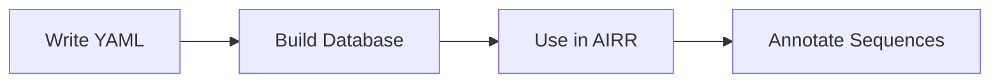

# Phase 23: Documentation

**Goal:** Document multi-source reference.yml usage and build workflow

**Requirements:**
- DOC-01: Create reference-sample.yml (mouse=imgt, human=ogrdb, macaque=vdjbase)
- DOC-02: Document build → use workflow

## Context

- YAML structure: `name → source → species → gene list`
- Available sources: `imgt`, `ogrdb`, `vdjbase`, `custom`
- CLI: `sadie reference make --reference <yaml> --outpath <path>`
- API: `References.from_yaml(yaml_path)` then `references.make_airr_database(output_path)`
- Airr API: `Airr(reference_name, references=References(...))` or use default paths

## Tasks

### Task 1: Create examples/reference-sample.yml

**File:** `examples/reference-sample.yml`
**Action:** Create multi-source reference configuration demonstrating all providers

```yaml
# SADIE Multi-Source Reference Configuration Sample
# =================================================
# This file demonstrates how to configure germline databases from multiple sources.
#
# YAML Structure:
#   name:              # Reference database name (used in Airr)
#     source:          # Provider: imgt, ogrdb, vdjbase, or custom
#       species:       # Species name
#         - GENE*01    # List of gene alleles
#
# Available Sources:
#   - imgt:    IMGT reference database (most comprehensive)
#   - ogrdb:   Open Germline Receptor Database (curated alleles)
#   - vdjbase: VDJbase curated germlines
#   - custom:  Your own custom sequences (see docs/germlines/custom-sequences.md)
#
# Tips:
#   - Each name creates a separate reference database
#   - You can mix sources within a single name
#   - Gene names must include allele (e.g., *01)
#   - Run: sadie reference make --reference reference-sample.yml --outpath ./output

# Example 1: Mouse germlines from IMGT
mouse-imgt:
  imgt:
    mouse:
      # V genes - Variable region
      - IGHV1-4*01
      - IGHV1-5*01
      - IGHV1-9*01
      - IGHV1-12*01
      - IGHV1-18*01
      - IGHV5-6*01
      - IGHV5-9*01
      # D genes - Diversity region
      - IGHD1-1*01
      - IGHD2-3*01
      - IGHD2-4*01
      - IGHD3-1*01
      - IGHD4-1*01
      # J genes - Joining region
      - IGHJ1*01
      - IGHJ2*01
      - IGHJ3*01
      - IGHJ4*01
      # Light chain kappa
      - IGKV1-110*01
      - IGKV3-1*01
      - IGKJ1*01
      - IGKJ2*01

# Example 2: Human germlines from OGRDB (curated alleles)
human-ogrdb:
  ogrdb:
    human:
      # V genes
      - IGHV1-2*02
      - IGHV1-18*01
      - IGHV1-69*01
      - IGHV3-23*01
      - IGHV3-30*01
      - IGHV4-34*01
      - IGHV4-59*01
      # D genes
      - IGHD3-10*01
      - IGHD3-22*01
      - IGHD6-13*01
      # J genes
      - IGHJ4*02
      - IGHJ5*02
      - IGHJ6*02
      # Light chains
      - IGKV1-39*01
      - IGKV3-20*01
      - IGKJ1*01
      - IGKJ4*01

# Example 3: Rhesus macaque subset from VDJbase
macaque-vdjbase:
  vdjbase:
    rhesus_macaque:
      # V genes
      - IGHV1-1*01
      - IGHV3-1*01
      - IGHV4-1*01
      # D genes
      - IGHD1-1*01
      - IGHD2-1*01
      # J genes
      - IGHJ1*01
      - IGHJ4*01

# Example 4: Combined multi-source for human (advanced)
# Demonstrates mixing sources for a single reference
human-multi:
  imgt:
    human:
      # Baseline from IMGT
      - IGHV1-2*02
      - IGHV3-23*01
      - IGHD3-10*01
      - IGHJ4*02
      - IGKV1-39*01
      - IGKJ1*01
  ogrdb:
    human:
      # Additional curated alleles from OGRDB
      - IGHV1-69*01
      - IGHV4-34*01
```

### Task 2: Create docs/reference-workflow.md

**File:** `docs/reference-workflow.md`
**Action:** Create comprehensive workflow documentation

```markdown
# Custom Reference Databases

Learn how to create custom germline reference databases for AIRR annotation using YAML configuration files.

## Overview

SADIE supports creating custom reference databases that combine germline sequences from multiple sources:

- **IMGT** - International ImMunoGeneTics information system
- **OGRDB** - Open Germline Receptor Database  
- **VDJbase** - Curated germline database
- **Custom** - Your own sequences

This enables:

- Focusing on specific genes relevant to your research
- Combining curated alleles from different databases
- Including custom/novel germline sequences
- Creating species-specific or project-specific databases

## Workflow Steps



### Step 1: Write YAML Configuration

Create a YAML file defining which genes to include from which sources.

**Structure:**
```yaml
reference_name:        # Name for this database (used in code)
  source:              # Provider: imgt, ogrdb, vdjbase, custom
    species:           # Species name
      - GENE*ALLELE    # List of genes with allele numbers
```

**Example** (`my-reference.yml`):
```yaml
my-project:
  imgt:
    human:
      - IGHV1-2*02
      - IGHV3-23*01
      - IGHD3-10*01
      - IGHJ4*02
```

!!! tip "Finding Gene Names"
    - IMGT genes: [IMGT Gene Database](https://www.imgt.org/genedb/)
    - OGRDB genes: [OGRDB](https://ogrdb.airr-community.org/)
    - Always include the allele number (e.g., `*01`, `*02`)

### Step 2: Build the Database

Use the CLI to build IgBLAST-compatible databases:

```bash
sadie reference make --reference my-reference.yml --outpath ./my-databases
```

**Output structure:**
```
my-databases/
├── Ig/
│   ├── blastdb/
│   │   └── my-project/
│   │       ├── my-project_V.nhr
│   │       ├── my-project_V.nin
│   │       ├── my-project_V.nsq
│   │       ├── my-project_D.*
│   │       └── my-project_J.*
│   └── internal_data/
│       └── my-project/
│           └── my-project.ndm.imgt
├── aux_db/
│   └── imgt/
│       └── my-project_gl.aux
└── .references_dataframe.csv.gz
```

### Step 3: Use in AIRR Annotation

#### Python API

```python
from sadie.airr import Airr
from sadie.reference import References

# Load your custom reference
references = References(default_output_path="./my-databases")

# Create Airr annotator with custom reference
airr = Airr(
    reference_name="my-project",
    references=references
)

# Annotate sequences
result = airr.run_file("sequences.fasta")
print(result)
```

#### Using References.from_yaml()

For programmatic database building:

```python
from sadie.reference import References

# Load and build from YAML
references = References.from_yaml("my-reference.yml")

# Build the database
output_path = references.make_airr_database("./my-databases")
print(f"Database built at: {output_path}")
```

## Complete Example

Here's a complete workflow from YAML to annotation:

### 1. Create reference.yml

```yaml
# research-project.yml
therapeutic-antibodies:
  imgt:
    human:
      # Common therapeutic V genes
      - IGHV1-69*01
      - IGHV3-23*01
      - IGHV4-34*01
      # D genes
      - IGHD3-10*01
      - IGHD3-22*01
      # J genes
      - IGHJ4*02
      - IGHJ6*02
      # Kappa light chain
      - IGKV1-39*01
      - IGKV3-20*01
      - IGKJ1*01
```

### 2. Build Database (CLI)

```bash
# Build the database
sadie reference make \
    --reference research-project.yml \
    --outpath ./therapeutic-db

# Verify it was created
ls ./therapeutic-db/Ig/blastdb/therapeutic-antibodies/
```

### 3. Run Annotation

```python
from sadie.airr import Airr
from sadie.reference import References

# Load custom database
refs = References(default_output_path="./therapeutic-db")

# Create annotator
airr = Airr("therapeutic-antibodies", references=refs)

# Annotate your sequences
results = airr.run_file("my-sequences.fasta")

# View results
print(results[['sequence_id', 'v_call', 'd_call', 'j_call', 'productive']])
```

**Example Output:**
```
   sequence_id      v_call     d_call    j_call  productive
0  seq_001     IGHV1-69*01  IGHD3-10*01  IGHJ4*02       True
1  seq_002     IGHV3-23*01  IGHD3-22*01  IGHJ6*02       True
```

## Multi-Source Configuration

Combine genes from different providers in one reference:

```yaml
comprehensive-human:
  # Baseline from IMGT
  imgt:
    human:
      - IGHV1-2*02
      - IGHV1-18*01
      - IGHD3-10*01
      - IGHJ4*02
  
  # Add curated alleles from OGRDB
  ogrdb:
    human:
      - IGHV1-69*13  # Novel allele from OGRDB
      - IGHV4-34*09  # Curated variant
```

!!! note "Source Priority"
    When the same gene appears in multiple sources, the order in the YAML determines priority. Later sources can add new alleles but won't override existing ones.

## Multi-Species Configuration

Create databases spanning multiple species:

```yaml
cross-species:
  imgt:
    human:
      - IGHV1-69*01
      - IGHD3-10*01
      - IGHJ4*02
    mouse:
      - IGHV1-4*01
      - IGHD1-1*01
      - IGHJ1*01
```

## Validation

### Check YAML Syntax

```bash
# Python one-liner to validate YAML
python -c "import yaml; yaml.safe_load(open('my-reference.yml'))"
```

### Verify Built Database

```bash
# Check database files exist
ls -la ./my-databases/Ig/blastdb/*/

# View reference dataframe
python -c "import pandas as pd; print(pd.read_csv('./my-databases/.references_dataframe.csv.gz').head())"
```

## Troubleshooting

### Gene Not Found

```
G3Error: Gene IGHV1-2*99 not found in imgt database for species human
```

**Solution:** Verify the gene name and allele exist in the source database. Check [IMGT Gene Database](https://www.imgt.org/genedb/) or run `sadie germlines populate` first.

### Missing D-REGION Error

```
ValueError: No D-REGION found in reference object
```

**Solution:** Include D genes in your YAML. Heavy chain annotation requires V, D, and J genes.

### Species Not Found

```
Error: Species 'human_modified' not found
```

**Solution:** Use standard species names: `human`, `mouse`, `rat`, `rabbit`, `rhesus_macaque`, etc. See the [Provider Guide](germlines/provider-guide.md) for full list.

## Sample Files

Download sample configurations:

- [`reference-sample.yml`](../examples/reference-sample.yml) - Multi-source example with mouse (IMGT), human (OGRDB), and macaque (VDJbase)

## See Also

- [Germline Management](germlines/index.md) - Managing germline databases
- [Provider Guide](germlines/provider-guide.md) - Understanding data sources
- [Custom Sequences](germlines/custom-sequences.md) - Adding your own sequences
- [AIRR Annotation](annotation.md) - Full annotation documentation
```

### Task 3: Update mkdocs.yml navigation

**File:** `mkdocs.yml`
**Action:** Add new docs page to navigation

Find the `nav:` section and add `reference-workflow.md` after `Reference Database`:

```yaml
nav:
  - SADIE: index.md
  - Reference Database: reference.md
  - Custom Reference Databases: reference-workflow.md  # ADD THIS LINE
  - Germline Database Management:
    # ... rest unchanged
```

## Success Criteria

1. ✅ `examples/reference-sample.yml` created with multi-source configuration:
   - mouse V/D/J from IMGT
   - human V/D/J from OGRDB
   - macaque subset from VDJbase
   - Multi-source human example (advanced)

2. ✅ `docs/reference-workflow.md` documents complete workflow:
   - Write YAML → Build database → Use in Airr
   - CLI command examples
   - Python API examples
   - Multi-source and multi-species examples
   - Troubleshooting section

3. ✅ mkdocs.yml updated with new navigation entry

4. ✅ Sample includes proper comments explaining structure

5. ✅ Code examples show complete workflow from YAML to annotation

## Implementation Notes

- Uses existing `sadie reference make` command (not hypothetical `build` command)
- References `References.from_yaml()` and `make_airr_database()` APIs
- Follows existing docs style with mkdocs-material admonitions
- Includes mermaid diagram for workflow visualization
- Links to related germlines documentation

## Files to Create/Modify

| File | Action |
|------|--------|
| `examples/reference-sample.yml` | Create |
| `docs/reference-workflow.md` | Create |
| `mkdocs.yml` | Modify (add nav entry) |

---
*Created: 2026-01-23*
