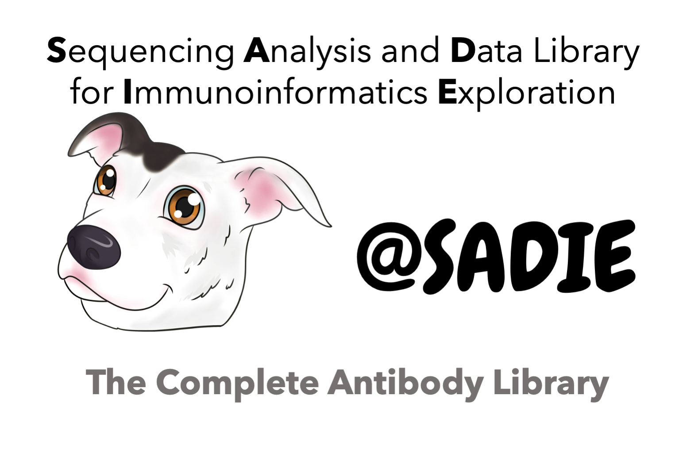

# 
 
 SADIE stands for **S**equencing **A**nalysis and **D**ata library for **I**mmunoinformatics **E**xploration. It is a complete antibody library with APIs to antibody repertoire sequencing tools, numbering annotation schemes and low-level antibody library objects. Most importantly it is tested and packaged for portability and use across multiple platforms. It leverages the Pandas DataFrame library for analysis of a single antibody sequence or billions.

